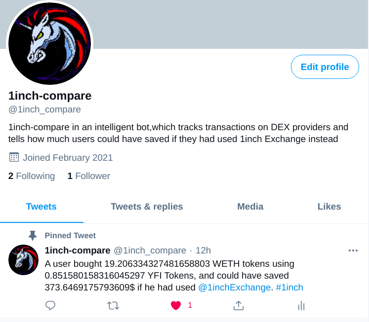
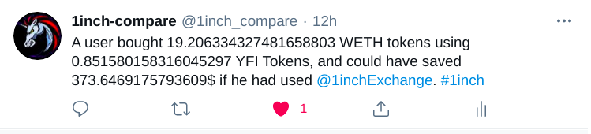
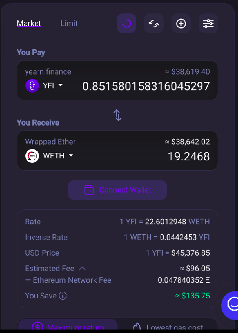
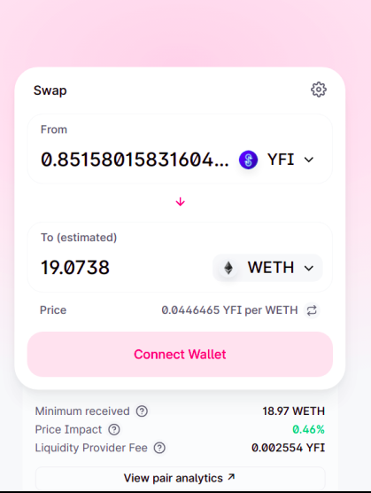
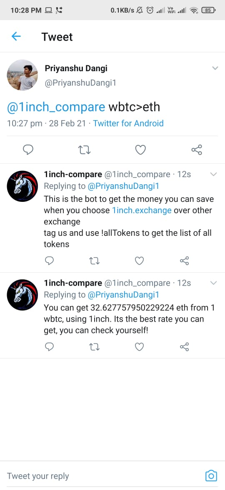
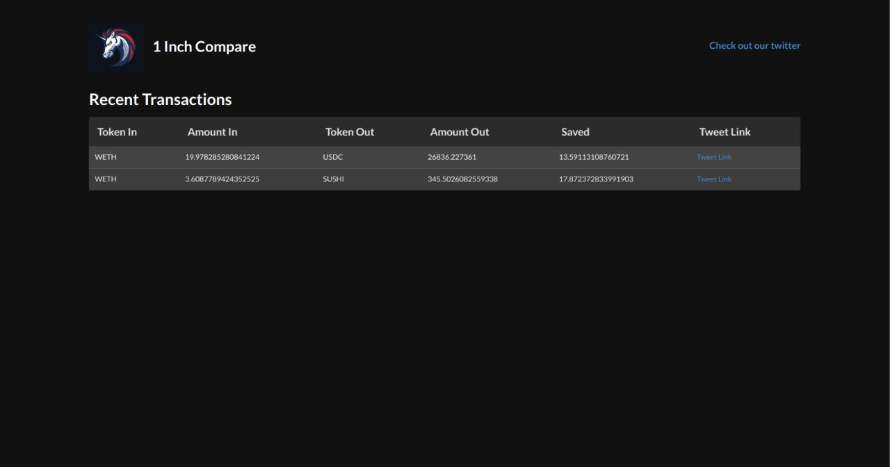

# 1inch-compare

With Elon Musk tweeting about every crypto-currency in existence, you need a reliable DEX Provider to help you jump on the wagon and make some quick bucks. 

<!--  -->
## Twitter handle of 1inch-compare bot:  [twitter.com/1inch_compare](https://twitter.com/1inch_compare)



 1inch-compare is an intelligent bot, which tracks transactions on [UNISWAP](https://uniswap.org/), [SUSHISWAP](https://sushiswap.fi/)(and are working on the support over other [DEX Providers](https://en.wikipedia.org/wiki/Decentralized_exchange) ) and tell how much users could have saved if they had used [1inch Exchange](https://1inch.exchange/) instead.

It tracks transactions at regular interval of time (interval can be changed in the config/config.js for local use) completed over various DEX's and tweets the amount that the user would have saved if he/she had done the same transaction via the [1inch.exchange](https://1inch.exchange/)

## Screenshot of a Tweet by our bot

  
For this tweet(or transaction) completed over uniswap we compared it with 1inch.exchange and you can see the results.

1inch.exchange            |  Uniswap
:-------------------------:|:-------------------------:
  |  

**It is clear by this data if this user had used 1inch.exchange[1inch.exchange](https://1inch.exchange/) for this transaction, he would have got more WETH for same price or got same WETH for a lower price.**

## Screenshot of chatbot

We also made a chatbot so that user can check the current conversion ratio on bot itself
**Additionally, users can tag @1inch_compare with a tweet like ETH>DAI to get an instant quote from @1inch.exchange!**




## frontend



## Setup

```Bash
git clone https://github.com/PriyanshuDangi/1inch-compare
cd 1inch-compare/
cp config/config.example.js config/config.js
```
**Generate your api keys from [here](https://developer.twitter.com/en/docs/authentication/oauth-1-0a/obtaining-user-access-tokens) and put them in the required fields in the config.js file**

```
npm install
npm start
npm run chat
```
 
 ## Contributions

- [fork this repo](https://github.com/PriyanshuDangi/1inch-compare/fork)
- checkout to <feature_branch>
- add feature / fix the bug
- git commit 
- send **Pull Request**

***Hurray !  you are a Contributor now !***

:star: ***this project if you like it !***

***This project is made with ❤️ by 1inch-compare team.***
